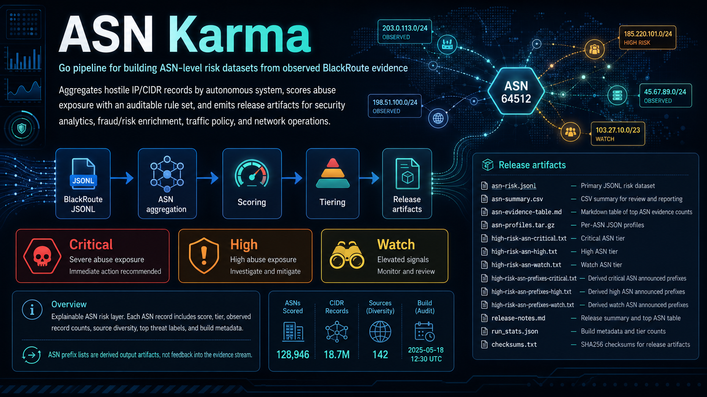

# ASN Karma

ASN Karma is a Go pipeline for building ASN-level risk datasets from observed BlackRoute evidence. It aggregates hostile IP/CIDR records by autonomous system, scores abuse exposure with an auditable rule set, and emits release artifacts for security analytics, fraud/risk enrichment, traffic policy, and network operations.

<p align="center">
  
</p>

<p align="center">
  <a href="./.github/workflows/build.yml"></a>
  
  
  
  
</p>

---

## Latest Release

Fresh dataset artifacts are published by the scheduled build. The links below point at the latest GitHub Release assets.

<!-- ASN_KARMA_RELEASE_START -->
_Last dataset build: `2026-06-28T08:05:30Z`_

[Open latest GitHub release](https://github.com/ipanalytics/ASN-Karma/releases/latest)

| Artifact | Download | Description |
| --- | --- | --- |
| `index.json` | [download](https://github.com/ipanalytics/ASN-Karma/releases/latest/download/index.json) | Machine-readable release manifest |
| `asn-risk.jsonl` | [download](https://github.com/ipanalytics/ASN-Karma/releases/latest/download/asn-risk.jsonl) | Primary JSONL risk dataset |
| `asn-changes.jsonl` | [download](https://github.com/ipanalytics/ASN-Karma/releases/latest/download/asn-changes.jsonl) | ASN delta feed since previous build |
| `asn-summary.csv` | [download](https://github.com/ipanalytics/ASN-Karma/releases/latest/download/asn-summary.csv) | CSV summary for review and reporting |
| `asn-evidence-table.md` | [download](https://github.com/ipanalytics/ASN-Karma/releases/latest/download/asn-evidence-table.md) | Markdown table of top ASN evidence counts |
| `asn-profiles.tar.gz` | [download](https://github.com/ipanalytics/ASN-Karma/releases/latest/download/asn-profiles.tar.gz) | Per-ASN JSON profiles |
| `source-impact.csv` | [download](https://github.com/ipanalytics/ASN-Karma/releases/latest/download/source-impact.csv) | Source contribution breakdown |
| `country-risk.csv` | [download](https://github.com/ipanalytics/ASN-Karma/releases/latest/download/country-risk.csv) | Country-level operational rollup |
| `high-risk-asn-critical.txt` | [download](https://github.com/ipanalytics/ASN-Karma/releases/latest/download/high-risk-asn-critical.txt) | Critical ASN tier |
| `high-risk-asn-high.txt` | [download](https://github.com/ipanalytics/ASN-Karma/releases/latest/download/high-risk-asn-high.txt) | High ASN tier |
| `high-risk-asn-watch.txt` | [download](https://github.com/ipanalytics/ASN-Karma/releases/latest/download/high-risk-asn-watch.txt) | Watch ASN tier |
| `high-risk-asn-prefixes-critical.txt` | [download](https://github.com/ipanalytics/ASN-Karma/releases/latest/download/high-risk-asn-prefixes-critical.txt) | Derived critical ASN announced prefixes |
| `high-risk-asn-prefixes-high.txt` | [download](https://github.com/ipanalytics/ASN-Karma/releases/latest/download/high-risk-asn-prefixes-high.txt) | Derived high ASN announced prefixes |
| `high-risk-asn-prefixes-watch.txt` | [download](https://github.com/ipanalytics/ASN-Karma/releases/latest/download/high-risk-asn-prefixes-watch.txt) | Derived watch ASN announced prefixes |
| `report.md` | [download](https://github.com/ipanalytics/ASN-Karma/releases/latest/download/report.md) | Markdown dataset report |
| `release-notes.md` | [download](https://github.com/ipanalytics/ASN-Karma/releases/latest/download/release-notes.md) | Release summary and top ASN table |
| `run_stats.json` | [download](https://github.com/ipanalytics/ASN-Karma/releases/latest/download/run_stats.json) | Build metadata and tier counts |
| `checksums.txt` | [download](https://github.com/ipanalytics/ASN-Karma/releases/latest/download/checksums.txt) | SHA256 checksums for release artifacts |

<!-- ASN_KARMA_RELEASE_END -->

## Overview

ASN Karma consumes BlackRoute JSONL records and produces an ASN risk layer designed for operational use. The output is intentionally explainable: each ASN record includes score, tier, observed record counts, source diversity, top threat labels, and build metadata.

The project treats ASN expansion as derived intelligence. Source evidence comes from observed IP/CIDR records only; generated ASN prefix lists are output artifacts, not feedback into the evidence stream.

## System Behavior

```text
BlackRoute JSONL
  -> parse observed IP/CIDR evidence
  -> enrich records without ASN via Team Cymru bulk whois
  -> aggregate records by ASN
  -> compute source diversity and threat label distribution
  -> apply scoring policy from configs/scoring.json
  -> write JSONL, CSV, TXT tiers, and run statistics
```

| Stage | Responsibility | Current implementation |
| --- | --- | --- |
| Ingest | Read BlackRoute-style JSONL with tolerant field mapping | `internal/blackroute` |
| Enrich | Map observed IP/CIDR records to ASN, country, and routed prefix | `internal/enrich` |
| Model | Normalize observed records and aggregate by ASN | `internal/model` |
| Scoring | Apply deterministic score and tier policy | `internal/scoring` |
| Output | Emit release artifacts for machines and operators | `internal/output` |
| Automation | Build and publish artifacts from GitHub Actions | `.github/workflows/build.yml` |

## Features

- Go CLI with no runtime service dependency.
- Team Cymru bulk whois enrichment for upstream records without ASN metadata.
- Deterministic ASN scoring from local configuration.
- JSONL primary output for downstream data pipelines.
- CSV summary for analyst workflows.
- Text tier files for infrastructure policy integration.
- 7/30/90 day history signals for persistence and trend.
- Confidence scoring alongside risk scoring.
- Per-ASN profile archive and derived announced-prefix artifacts.
- SHA256 checksums for release artifacts.
- GitHub Actions workflow for scheduled dataset builds.
- Explicit `expanded_prefixes_are_evidence: false` field in risk records.
- Local smoke-test fixture under `data/blackroute.example.jsonl`.

## Quick Start

```sh
go test ./...
go run ./cmd/asn-karma \
  -input data/blackroute.example.jsonl \
  -out release \
  -readme README.md
```

The command writes release artifacts into `release/`.

```text
release/
  index.json
  asn-risk.jsonl
  asn-changes.jsonl
  asn-summary.csv
  asn-evidence-table.md
  asn-profiles.tar.gz
  source-impact.csv
  country-risk.csv
  high-risk-asn-critical.txt
  high-risk-asn-high.txt
  high-risk-asn-watch.txt
  high-risk-asn-prefixes-critical.txt
  high-risk-asn-prefixes-high.txt
  high-risk-asn-prefixes-watch.txt
  report.md
  release-notes.md
  run_stats.json
  checksums.txt
```

## Installation

### From Source

```sh
git clone https://github.com/ipanalytics/ASN-Karma.git
cd ASN-Karma
go build -o bin/asn-karma ./cmd/asn-karma
```

### Requirements

| Component | Version |
| --- | --- |
| Go | 1.22 or newer |
| Input dataset | BlackRoute JSONL |
| Runtime | Linux, macOS, or containerized CI |

## Usage

Run against a local BlackRoute export:

```sh
asn-karma \
  -input data/blackroute.jsonl \
  -config configs/scoring.json \
  -out release
```

ASN enrichment is enabled by default. For offline parser tests against data that already contains ASN fields:

```sh
asn-karma \
  -input data/blackroute.example.jsonl \
  -out release \
  -asn-enrich=false
```

Use a fixed build timestamp for reproducible test output:

```sh
asn-karma \
  -input data/blackroute.example.jsonl \
  -out /tmp/asn-karma-release \
  -built-at 2026-06-15T00:00:00Z
```

Run directly with Go:

```sh
go run ./cmd/asn-karma -input data/blackroute.jsonl -out release
```

## Outputs

| Artifact | Format | Purpose |
| --- | --- | --- |
| `index.json` | JSON | Machine-readable release manifest with sizes and SHA256 hashes |
| `asn-risk.jsonl` | JSONL | Primary machine-readable ASN risk dataset |
| `asn-changes.jsonl` | JSONL | Delta feed since previous build |
| `asn-summary.csv` | CSV | Compact review and reporting table |
| `asn-evidence-table.md` | Markdown | Top ASN evidence table used by README and release notes |
| `asn-profiles.tar.gz` | tar.gz | Per-ASN JSON profiles with risk, history, confidence, and derived prefixes |
| `source-impact.csv` | CSV | Source contribution and ASN impact summary |
| `country-risk.csv` | CSV | Country-level operational rollup |
| `high-risk-asn-critical.txt` | TXT | Strict action tier |
| `high-risk-asn-high.txt` | TXT | Challenge or rate-limit tier |
| `high-risk-asn-watch.txt` | TXT | Enrichment and logging tier |
| `high-risk-asn-prefixes-critical.txt` | TXT | Derived announced prefixes for critical ASN tier |
| `high-risk-asn-prefixes-high.txt` | TXT | Derived announced prefixes for high ASN tier |
| `high-risk-asn-prefixes-watch.txt` | TXT | Derived announced prefixes for watch ASN tier |
| `report.md` | Markdown | Rendered release report with deltas, countries, and source impact |
| `release-notes.md` | Markdown | GitHub Release body with run summary and top ASN table |
| `run_stats.json` | JSON | Build metadata and tier counts |
| `checksums.txt` | TXT | SHA256 checksums for release artifacts |

## Changes Since Previous Build

The scheduled build updates this table from `asn-changes.jsonl`. It shows the largest ASN-level deltas compared with the previous persisted history snapshot.

<!-- ASN_KARMA_TABLE_START -->
_Last updated: `2026-06-28T08:05:30Z`_

| ASN | Name | Country | Change | Previous | Current | Evidence Delta |
| --- | --- | --- | --- | ---: | ---: | ---: |
| AS4134 | CHINANET-BACKBONE - No.31,Jin-rong Street, CN | CN | `evidence_increased` | 77104 | 143500 | +66396 |
| AS4837 | CHINA169-Backbone - CHINA UNICOM China169 Backbone, CN | CN | `evidence_increased` | 42362 | 80923 | +38561 |
| AS14061 | DIGITALOCEAN-ASN - DigitalOcean, LLC, US | US | `evidence_increased` | 163689 | 195938 | +32249 |
| AS4766 | KIXS-AS-KR-KR - Korea Telecom, KR | KR | `evidence_increased` | 6595 | 28875 | +22280 |
| AS45090 | TENCENT-NET-AP - Shenzhen Tencent Computer Systems Company Limited, CN | CN | `evidence_increased` | 17019 | 37000 | +19981 |
| AS3462 | HINET - Data Communication Business Group, TW | TW | `evidence_increased` | 4995 | 20057 | +15062 |
| AS9829 | BSNL-NIB - National Internet Backbone, IN | IN | `evidence_increased` | 11338 | 26301 | +14963 |
| AS132203 | TENCENT-NET-AP-CN - Tencent Building, Kejizhongyi Avenue, CN | SG | `evidence_increased` | 21684 | 33071 | +11387 |
| AS45899 | VNPT-AS-VN - VNPT Corp, VN | VN | `evidence_increased` | 6519 | 15179 | +8660 |
| AS37963 | ALIBABA-CN-NET - Hangzhou Alibaba Advertising Co.,Ltd., CN | CN | `evidence_increased` | 57234 | 64082 | +6848 |
| AS63949 | AKAMAI-LINODE-AP - Akamai Connected Cloud, SG | US | `evidence_increased` | 12594 | 18532 | +5938 |
| AS16276 | OVH - OVH SAS, FR | FR | `evidence_increased` | 34921 | 40842 | +5921 |
| AS396982 | GOOGLE-CLOUD-PLATFORM - Google LLC, US | US | `evidence_increased` | 50240 | 55950 | +5710 |
| AS8151 | AS8151 - UNINET, MX | MX | `evidence_increased` | 3273 | 8584 | +5311 |
| AS16509 | AMAZON-02 - Amazon.com, Inc., US | US | `evidence_increased` | 365761 | 370817 | +5056 |
| AS12389 | ROSTELECOM-AS - PJSC Rostelecom, RU | RU | `evidence_increased` | 12867 | 17344 | +4477 |
| AS7922 | COMCAST-7922 - Comcast Cable Communications, LLC, US | US | `evidence_increased` | 3555 | 7637 | +4082 |
| AS8452 | TE-AS - IDDQD-AS, EG | EG | `evidence_increased` | 2007 | 5834 | +3827 |
| AS8048 | AS8048 - CANTV Servicios, Venezuela, VE | VE | `evidence_increased` | 973 | 4796 | +3823 |
| AS9808 | CHINAMOBILE-CN - China Mobile Communications Group Co., Ltd., CN | CN | `evidence_increased` | 4268 | 8073 | +3805 |
| AS140292 | CHINATELECOM-JIANGSU-SUZHOU-5G-NETWORK - CHINATELECOM Jiangsu province Suzhou 5G network, CN | CN | `evidence_increased` | 1564 | 5330 | +3766 |
| AS38365 | Baidu - Beijing Baidu Netcom Science and Technology Co., Ltd., CN | CN | `evidence_increased` | 1147 | 4742 | +3595 |
| AS4713 | OCN - NTT DOCOMO BUSINESS,Inc., JP | JP | `evidence_increased` | 1087 | 4566 | +3479 |
| AS45102 | ALIBABA-CN-NET - Alibaba (US) Technology Co., Ltd., CN | US | `evidence_increased` | 38317 | 41656 | +3339 |
| AS7713 | telkomnet-as-ap - PT Telekomunikasi Indonesia, ID | ID | `evidence_increased` | 3423 | 6645 | +3222 |

<!-- ASN_KARMA_TABLE_END -->

### Risk Record

When ASN records are available, `asn-risk.jsonl` contains one JSON object per ASN:

```json
{
  "asn": 64500,
  "asn_name": "Example Hosting",
  "country": "US",
  "risk_score": 39,
  "risk_level": "low",
  "confidence_score": 40,
  "confidence": "low",
  "recommended_action": "no_action",
  "observed_records": 2,
  "unique_observed_cidrs": 2,
  "source_count": 2,
  "source_diversity": 2,
  "top_threat_labels": {
    "c2_ioc": 1,
    "malware_host_active": 1,
    "network_scan_or_abuse": 1
  },
  "evidence_window_days": 30,
  "persistence_days_30d": 1,
  "active_days_7d": 1,
  "active_days_30d": 1,
  "active_days_90d": 1,
  "first_seen": "2026-06-15",
  "last_seen": "2026-06-15",
  "trend": "new",
  "evidence_delta_1d": 2,
  "expanded_prefix_count": 0,
  "expanded_prefixes_are_evidence": false,
  "large_cloud": false,
  "watchlist": false,
  "built_at": "2026-06-15T00:00:00Z"
}
```

If a build is explicitly allowed to complete with zero ASN records, `asn-risk.jsonl` contains a single `build_status` JSON object explaining that no ASN records were produced. Scheduled production builds do not use `-allow-empty`; an empty ASN dataset fails before release publication.

## Data Contracts

Schemas are kept under `docs/schema/`:

| Schema | Covers |
| --- | --- |
| `docs/schema/asn-risk.schema.json` | `asn-risk.jsonl` records |
| `docs/schema/asn-changes.schema.json` | `asn-changes.jsonl` records |
| `docs/schema/index.schema.json` | `index.json` release manifest |
| `docs/schema/run-stats.schema.json` | `run_stats.json` |

## Integration Examples

Operational examples are available under `examples/`:

| File | Target |
| --- | --- |
| `examples/cloudflare-waf.md` | Cloudflare WAF ASN policy |
| `examples/nginx-map.md` | NGINX enrichment map pattern |
| `examples/opnsense-alias.md` | OPNsense firewall aliases |
| `examples/splunk-lookup.md` | Splunk CSV lookup |
| `examples/clickhouse-ingest.sql` | ClickHouse JSONL ingestion |

## Scoring Policy

Scoring is configured in `configs/scoring.json`.

| Signal | Role |
| --- | --- |
| Source diversity | Rewards corroboration across feeds |
| Threat severity | Weights labels such as C2, malware hosting, spam, and scanning |
| Recent activity | Captures observed volume in the build window |
| Abuse density proxy | Gives smaller concentrated abuse surfaces weight |
| Cybercrime prefix bonus | Adds weight for severe infrastructure labels |
| Large cloud penalty | Reduces broad-provider overclassification |
| Allowlist penalty | Suppresses known infrastructure where appropriate |
| Watchlist flag | Adds context without turning context into evidence |

Risk tiers are emitted as `critical`, `high`, `watch`, or `low`.

## Operational Notes

- Treat `asn-risk.jsonl` as the canonical artifact.
- Use TXT tier files as policy inputs only after local validation.
- Keep scoring changes reviewable; policy drift should be visible in config diffs.
- Do not feed derived ASN prefix expansion back into source evidence.
- Verify downloaded artifacts with `checksums.txt`.
- ASNs marked `review_required=true` are large cloud, backbone, CDN, or major hosting networks; they are capped to review/watch policy unless local telemetry supports enforcement.
- Large cloud and CDN networks need provider-aware handling in production policy.
- Run builds on a schedule after the upstream BlackRoute release has completed.

## Project Scope

ASN Karma focuses on ASN-level aggregation, scoring, and artifact generation. It is designed to sit between raw IP reputation feeds and downstream enforcement, enrichment, or analytics systems.

Planned extension points include:

- Optional release signing.
- GitHub Pages dataset index.

## Use Cases

- Enrich SIEM, SOAR, and data lake events with ASN risk context.
- Feed WAF, CDN, and edge policy with conservative ASN tiers.
- Track abuse concentration across hosting providers and network operators.
- Support fraud and risk pipelines with infrastructure-level features.
- Build daily ASN exposure reports for security operations.

## Limitations

ASN-level scoring is coarse by design. It should be combined with local telemetry, asset context, customer impact analysis, and provider-specific knowledge before enforcement.

Team Cymru enrichment uses current BGP attribution. For historical analysis, run the scorer against input that already carries time-appropriate ASN metadata.

## Directory Structure

```text
.
├── cmd/asn-karma/              # CLI entrypoint
├── configs/                    # scoring and policy configuration
├── data/                       # local fixtures and input data
├── data/history/               # persisted daily ASN history state
├── docs/schema/                # JSON schema contracts
├── examples/                   # integration examples
├── internal/blackroute/         # BlackRoute JSONL ingest
├── internal/enrich/             # ASN enrichment adapters
├── internal/model/              # normalized records and aggregation
├── internal/output/             # release artifact writers
├── internal/scoring/            # scoring policy implementation
├── release/                     # generated artifacts
├── site/                        # README and documentation assets
└── .github/workflows/           # scheduled build automation
```

## Deployment

The repository includes a scheduled GitHub Actions workflow:

```yaml
on:
  schedule:
    - cron: "47 4 * * *"
  workflow_dispatch:
```

The workflow tests the Go code, downloads the latest BlackRoute JSONL release, builds ASN Karma artifacts, updates the README evidence table, and publishes the generated files as a GitHub release.

For self-hosted deployments, run the CLI from cron, systemd timers, Kubernetes CronJobs, or an existing data orchestration system. The process is batch-oriented and writes immutable output files for each run.

<details>
<summary>Example Kubernetes CronJob command</summary>

```yaml
command:
  - /usr/local/bin/asn-karma
  - -input
  - /data/blackroute.jsonl
  - -config
  - /config/scoring.json
  - -out
  - /release
```

</details>

## License

MIT license.

## Disclaimer

ASN Karma provides infrastructure risk signals derived from public abuse evidence. Operators are responsible for applying local policy, validation, and impact controls before enforcement.
