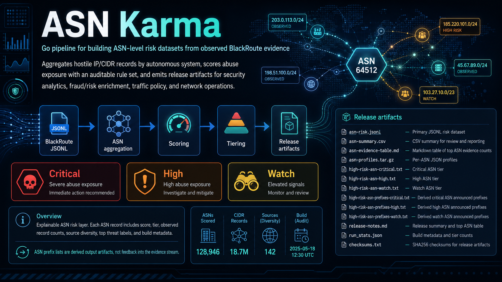

_English version: [README.md](README.md)_

# ASN Karma

ASN Karma — это конвейер (pipeline) на Go для построения наборов данных о рисках на уровне ASN на основе наблюдаемых свидетельств BlackRoute. Он агрегирует записи о враждебных IP/CIDR по автономным системам, оценивает уровень злоупотреблений с помощью проверяемого набора правил и формирует артефакты релиза для аналитики безопасности, обогащения данных о мошенничестве/рисках, политик трафика и сетевых операций.

<p align="center">
  
</p>

<p align="center">
  <a href="./.github/workflows/build.yml"></a>
  
  
  
  
</p>

---

## Последний релиз

Свежие артефакты набора данных публикуются запланированной сборкой. Ссылки ниже указывают на ресурсы последнего GitHub Release.

<!-- ASN_KARMA_RELEASE_START -->
_Последняя сборка набора данных: `2026-09-12T08:51:27Z`_

[Открыть последний GitHub-релиз](https://github.com/ipanalytics/ASN-Karma/releases/tag/asn-karma-latest)

| Артефакт | Загрузка | Описание |
| --- | --- | --- |
| `index.json` | [скачать](https://github.com/ipanalytics/ASN-Karma/releases/download/asn-karma-latest/index.json) | Машиночитаемый манифест релиза |
| `asn-risk.jsonl` | [скачать](https://github.com/ipanalytics/ASN-Karma/releases/download/asn-karma-latest/asn-risk.jsonl) | Основной набор данных рисков в формате JSONL |
| `asn-changes.jsonl` | [скачать](https://github.com/ipanalytics/ASN-Karma/releases/download/asn-karma-latest/asn-changes.jsonl) | Лента изменений ASN с момента предыдущей сборки |
| `asn-summary.csv` | [скачать](https://github.com/ipanalytics/ASN-Karma/releases/download/asn-karma-latest/asn-summary.csv) | CSV-сводка для проверки и отчётности |
| `asn-evidence-table.md` | [скачать](https://github.com/ipanalytics/ASN-Karma/releases/download/asn-karma-latest/asn-evidence-table.md) | Markdown-таблица ведущих ASN по количеству свидетельств |
| `asn-history.jsonl.gz` | [скачать](https://github.com/ipanalytics/ASN-Karma/releases/download/asn-karma-latest/asn-history.jsonl.gz) | Сжатое состояние истории, используемое следующей запланированной сборкой |
| `asn-profiles.tar.gz` | [скачать](https://github.com/ipanalytics/ASN-Karma/releases/download/asn-karma-latest/asn-profiles.tar.gz) | JSON-профили по каждому ASN |
| `source-impact.csv` | [скачать](https://github.com/ipanalytics/ASN-Karma/releases/download/asn-karma-latest/source-impact.csv) | Разбивка вклада по источникам |
| `country-risk.csv` | [скачать](https://github.com/ipanalytics/ASN-Karma/releases/download/asn-karma-latest/country-risk.csv) | Оперативная сводка на уровне стран |
| `high-risk-asn-critical.txt` | [скачать](https://github.com/ipanalytics/ASN-Karma/releases/download/asn-karma-latest/high-risk-asn-critical.txt) | Критический уровень ASN |
| `high-risk-asn-high.txt` | [скачать](https://github.com/ipanalytics/ASN-Karma/releases/download/asn-karma-latest/high-risk-asn-high.txt) | Высокий уровень ASN |
| `high-risk-asn-watch.txt` | [скачать](https://github.com/ipanalytics/ASN-Karma/releases/download/asn-karma-latest/high-risk-asn-watch.txt) | Уровень ASN под наблюдением |
| `high-risk-asn-prefixes-critical.txt` | [скачать](https://github.com/ipanalytics/ASN-Karma/releases/download/asn-karma-latest/high-risk-asn-prefixes-critical.txt) | Производные анонсируемые префиксы критических ASN |
| `high-risk-asn-prefixes-high.txt` | [скачать](https://github.com/ipanalytics/ASN-Karma/releases/download/asn-karma-latest/high-risk-asn-prefixes-high.txt) | Производные анонсируемые префиксы высокорисковых ASN |
| `high-risk-asn-prefixes-watch.txt` | [скачать](https://github.com/ipanalytics/ASN-Karma/releases/download/asn-karma-latest/high-risk-asn-prefixes-watch.txt) | Производные анонсируемые префиксы ASN под наблюдением |
| `report.md` | [скачать](https://github.com/ipanalytics/ASN-Karma/releases/download/asn-karma-latest/report.md) | Markdown-отчёт по набору данных |
| `release-notes.md` | [скачать](https://github.com/ipanalytics/ASN-Karma/releases/download/asn-karma-latest/release-notes.md) | Сводка релиза и таблица ведущих ASN |
| `run_stats.json` | [скачать](https://github.com/ipanalytics/ASN-Karma/releases/download/asn-karma-latest/run_stats.json) | Метаданные сборки и счётчики по уровням |
| `checksums.txt` | [скачать](https://github.com/ipanalytics/ASN-Karma/releases/download/asn-karma-latest/checksums.txt) | Контрольные суммы SHA256 артефактов релиза |

<!-- ASN_KARMA_RELEASE_END -->

## Обзор

ASN Karma потребляет записи BlackRoute в формате JSONL и формирует слой рисков ASN, предназначенный для эксплуатационного использования. Выходные данные намеренно объяснимы: каждая запись ASN включает оценку, уровень, количество наблюдавшихся записей, разнообразие источников, основные метки угроз и метаданные сборки.

Проект рассматривает расширение ASN как производную разведывательную информацию (derived intelligence). Исходные свидетельства поступают исключительно из наблюдаемых записей IP/CIDR; сгенерированные списки префиксов ASN являются выходными артефактами и не возвращаются в поток свидетельств.

## Поведение системы

```text
BlackRoute JSONL
  -> parse observed IP/CIDR evidence
  -> enrich records without ASN via Team Cymru bulk whois
  -> aggregate records by ASN
  -> compute source diversity and threat label distribution
  -> apply scoring policy from configs/scoring.json
  -> write JSONL, CSV, TXT tiers, and run statistics
```

| Этап | Ответственность | Текущая реализация |
| --- | --- | --- |
| Ingest | Чтение JSONL в стиле BlackRoute с толерантным сопоставлением полей | `internal/blackroute` |
| Enrich | Сопоставление наблюдаемых записей IP/CIDR с ASN, страной и анонсированным префиксом | `internal/enrich` |
| Model | Нормализация наблюдаемых записей и агрегация по ASN | `internal/model` |
| Scoring | Применение детерминированной политики оценки и уровней | `internal/scoring` |
| Output | Формирование релизных артефактов для машин и операторов | `internal/output` |
| Automation | Сборка и публикация артефактов из GitHub Actions | `.github/workflows/build.yml` |

## Возможности

- CLI на Go без зависимости от сервисов во время выполнения.
- Обогащение через Team Cymru bulk whois для входных записей без метаданных ASN.
- Детерминированный скоринг ASN на основе локальной конфигурации.
- Основной вывод в формате JSONL для последующих конвейеров обработки данных.
- CSV-сводка для рабочих процессов аналитиков.
- Текстовые файлы уровней для интеграции в политики инфраструктуры.
- Сигналы истории за 7/30/90 дней для оценки устойчивости и трендов.
- Оценка достоверности (confidence) наряду с оценкой риска.
- Архив профилей по каждому ASN и производные артефакты анонсированных префиксов.
- Контрольные суммы SHA256 для релизных артефактов.
- Workflow в GitHub Actions для сборки наборов данных по расписанию.
- Явное поле `expanded_prefixes_are_evidence: false` в записях о риске.
- Локальная фикстура для smoke-тестов в `data/blackroute.example.jsonl`.

## Быстрый старт

```sh
go test ./...
go run ./cmd/asn-karma \
  -input data/blackroute.example.jsonl \
  -out release \
  -readme README.md
```

Команда записывает релизные артефакты в `release/`.

```text
release/
  index.json
  asn-risk.jsonl
  asn-changes.jsonl
  asn-summary.csv
  asn-evidence-table.md
  asn-profiles.tar.gz
  source-impact.csv
  country-risk.csv
  high-risk-asn-critical.txt
  high-risk-asn-high.txt
  high-risk-asn-watch.txt
  high-risk-asn-prefixes-critical.txt
  high-risk-asn-prefixes-high.txt
  high-risk-asn-prefixes-watch.txt
  report.md
  release-notes.md
  run_stats.json
  checksums.txt
```

## Установка

### Из исходного кода

```sh
git clone https://github.com/ipanalytics/ASN-Karma.git
cd ASN-Karma
go build -o bin/asn-karma ./cmd/asn-karma
```

### Требования

| Компонент | Версия |
| --- | --- |
| Go | 1.22 или новее |
| Входной набор данных | BlackRoute JSONL |
| Среда выполнения | Linux, macOS или контейнеризованный CI |

## Использование

Запуск на локальном экспорте BlackRoute:

```sh
asn-karma \
  -input data/blackroute.jsonl \
  -config configs/scoring.json \
  -out release
```

Обогащение ASN включено по умолчанию. Для офлайн-тестов парсера на данных, уже содержащих поля ASN:

```sh
asn-karma \
  -input data/blackroute.example.jsonl \
  -out release \
  -asn-enrich=false
```

Используйте фиксированную временную метку сборки для воспроизводимого тестового вывода:

```sh
asn-karma \
  -input data/blackroute.example.jsonl \
  -out /tmp/asn-karma-release \
  -built-at 2026-06-15T00:00:00Z
```

Запуск напрямую через Go:

```sh
go run ./cmd/asn-karma -input data/blackroute.jsonl -out release
```

## Выходные артефакты

| Артефакт | Формат | Назначение |
| --- | --- | --- |
| `index.json` | JSON | Машиночитаемый манифест релиза с размерами и хешами SHA256 |
| `asn-risk.jsonl` | JSONL | Основной машиночитаемый набор данных о рисках ASN |
| `asn-changes.jsonl` | JSONL | Лента дельт с момента предыдущей сборки |
| `asn-summary.csv` | CSV | Компактная таблица для просмотра и отчётности |
| `asn-evidence-table.md` | Markdown | Таблица топовых ASN по свидетельствам, используемая в README и заметках о релизе |
| `asn-profiles.tar.gz` | tar.gz | JSON-профили по каждому ASN с риском, историей, достоверностью и производными префиксами |
| `source-impact.csv` | CSV | Сводка по вкладу источников и влиянию на ASN |
| `country-risk.csv` | CSV | Оперативная сводка на уровне стран |
| `high-risk-asn-critical.txt` | TXT | Уровень строгих действий |
| `high-risk-asn-high.txt` | TXT | Уровень проверки (challenge) или ограничения частоты (rate-limit) |
| `high-risk-asn-watch.txt` | TXT | Уровень обогащения и логирования |
| `high-risk-asn-prefixes-critical.txt` | TXT | Производные анонсированные префиксы для критического уровня ASN |
| `high-risk-asn-prefixes-high.txt` | TXT | Производные анонсированные префиксы для высокого уровня ASN |
| `high-risk-asn-prefixes-watch.txt` | TXT | Производные анонсированные префиксы для наблюдаемого уровня ASN |
| `report.md` | Markdown | Отрендеренный отчёт о релизе с дельтами, странами и влиянием источников |
| `release-notes.md` | Markdown | Тело GitHub Release со сводкой запуска и таблицей топовых ASN |
| `run_stats.json` | JSON | Метаданные сборки и счётчики по уровням |
| `checksums.txt` | TXT | Контрольные суммы SHA256 для релизных артефактов |

## Изменения с предыдущей сборки

Запланированная сборка обновляет эту таблицу из `asn-changes.jsonl`. Она показывает наибольшие изменения на уровне ASN по сравнению с предыдущим сохранённым снимком истории.

<!-- ASN_KARMA_TABLE_START -->
_Последнее обновление: `2026-09-12T08:51:27Z`_

| ASN | Название | Страна | Изменение | Предыдущее | Текущее | Дельта свидетельств |
| --- | --- | --- | --- | ---: | ---: | ---: |
| AS4134 | CHINANET-BACKBONE - No.31,Jin-rong Street, CN | CN | `evidence_increased` | 138159 | 154808 | +16649 |
| AS4837 | CHINA169-Backbone - CHINA UNICOM China169 Backbone, CN | CN | `evidence_increased` | 83802 | 88417 | +4615 |
| AS20011 | Dimension Data - Dimension Data, ZA | ZA | `evidence_decreased` | 61588 | 57308 | -4280 |
| AS12322 | PROXAD - Free SAS, FR | FR | `evidence_decreased` | 6483 | 3166 | -3317 |
| AS39435 | EVOLGOGRAD-AS - JSC _ER-Telecom Holding_, RU | RU | `evidence_increased` | 110 | 2141 | +2031 |
| AS10474 | Dimension Data - Dimension Data, ZA | ZA | `evidence_decreased` | 2926 | 1531 | -1395 |
| AS328029 | Web Telecom Services (PTY) Ltd - Web Telecom Services (PTY) Ltd, ZA | ZA | `evidence_decreased` | 947 | 37 | -910 |
| AS396982 | GOOGLE-CLOUD-PLATFORM - Google LLC, US | US | `evidence_increased` | 95476 | 96243 | +767 |
| AS21928 | T-MOBILE-AS21928 - T-Mobile USA, Inc., US | US | `evidence_decreased` | 1590 | 838 | -752 |
| AS16509 | AMAZON-02 - Amazon.com, Inc., US | US | `evidence_increased` | 452866 | 453580 | +714 |
| AS14061 | DIGITALOCEAN-ASN - DigitalOcean, LLC, US | US | `evidence_decreased` | 177177 | 176468 | -709 |
| AS7552 | VIETEL-AS-AP - Viettel Group, VN | VN | `evidence_decreased` | 11367 | 10801 | -566 |
| AS3320 | DTAG - Deutsche Telekom AG, DE | DE | `evidence_increased` | 4454 | 5012 | +558 |
| AS19527 | GOOGLE-2 - Google LLC, US | US | `evidence_increased` | 363 | 905 | +542 |
| AS43515 | YOUTUBE - Google Ireland Limited, IE | US | `evidence_decreased` | 1267 | 728 | -539 |
| AS271942 | AS271942 - CV HOTSPOT, S.R.L., DO | US | `risk_level_changed` | 4 | 516 | +512 |
| AS63949 | AKAMAI-LINODE-AP - Akamai Connected Cloud, SG | US | `evidence_decreased` | 22143 | 21637 | -506 |
| AS210874 | box-broadband - Box Broadband Limited, GB | NL | `risk_level_changed` | 445 | 4 | -441 |
| AS7922 | COMCAST-7922 - Comcast Cable Communications, LLC, US | US | `evidence_increased` | 13851 | 14287 | +436 |
| AS51396 | PFCLOUD - Pfcloud UG (haftungsbeschrankt), DE | DE | `evidence_decreased` | 1049 | 636 | -413 |
| AS54936 | WGL-107-ZONA-WYYERD - Wyyerd Group, US | US | `evidence_increased` | 60 | 444 | +384 |
| AS17816 | CHINA169-GZ - China Unicom IP network China169 Guangdong province, CN | CN | `evidence_increased` | 2844 | 3174 | +330 |
| AS5410 | BOUYGTEL-ISP - Bouygues Telecom SA, FR | FR | `evidence_decreased` | 1259 | 947 | -312 |
| AS4812 | CHINANET-SH-AP - China Telecom (Group), CN | CN | `evidence_increased` | 3290 | 3597 | +307 |
| AS398113 | GATEWAY-FIBER - Gateway Fiber LLC, US | US | `risk_level_changed` | 17 | 303 | +286 |

<!-- ASN_KARMA_TABLE_END -->

### Запись о риске

Когда записи ASN доступны, `asn-risk.jsonl` содержит один JSON-объект на каждый ASN:

```json
{
  "asn": 64500,
  "asn_name": "Example Hosting",
  "country": "US",
  "risk_score": 39,
  "risk_level": "low",
  "confidence_score": 40,
  "confidence": "low",
  "recommended_action": "no_action",
  "observed_records": 2,
  "unique_observed_cidrs": 2,
  "source_count": 2,
  "source_diversity": 2,
  "top_threat_labels": {
    "c2_ioc": 1,
    "malware_host_active": 1,
    "network_scan_or_abuse": 1
  },
  "evidence_window_days": 30,
  "persistence_days_30d": 1,
  "active_days_7d": 1,
  "active_days_30d": 1,
  "active_days_90d": 1,
  "first_seen": "2026-06-15",
  "last_seen": "2026-06-15",
  "trend": "new",
  "evidence_delta_1d": 2,
  "expanded_prefix_count": 0,
  "expanded_prefixes_are_evidence": false,
  "large_cloud": false,
  "watchlist": false,
  "built_at": "2026-06-15T00:00:00Z"
}
```

Если сборке явно разрешено завершиться с нулём записей ASN, `asn-risk.jsonl` содержит единственный JSON-объект `build_status`, поясняющий, что записи ASN не были сформированы. Запланированные производственные сборки не используют `-allow-empty`; пустой набор данных ASN приводит к сбою до публикации релиза.

## Контракты данных

Схемы хранятся в `docs/schema/`:

| Схема | Охватывает |
| --- | --- |
| `docs/schema/asn-risk.schema.json` | записи `asn-risk.jsonl` |
| `docs/schema/asn-changes.schema.json` | записи `asn-changes.jsonl` |
| `docs/schema/index.schema.json` | манифест релиза `index.json` |
| `docs/schema/run-stats.schema.json` | `run_stats.json` |

## Примеры интеграции

Практические примеры доступны в `examples/`:

| Файл | Назначение |
| --- | --- |
| `examples/cloudflare-waf.md` | Политика ASN для Cloudflare WAF |
| `examples/nginx-map.md` | Шаблон карты обогащения NGINX |
| `examples/opnsense-alias.md` | Алиасы межсетевого экрана OPNsense |
| `examples/splunk-lookup.md` | CSV lookup для Splunk |
| `examples/clickhouse-ingest.sql` | Загрузка JSONL в ClickHouse |

## Политика скоринга

Скоринг настраивается в `configs/scoring.json`.

| Сигнал | Роль |
| --- | --- |
| Разнообразие источников | Вознаграждает подтверждение между фидами |
| Степень угрозы | Взвешивает метки, такие как C2, хостинг вредоносного ПО, спам и сканирование |
| Недавняя активность | Учитывает наблюдаемый объём за окно сборки |
| Прокси-показатель плотности злоупотреблений | Придаёт вес небольшим концентрированным поверхностям злоупотреблений |
| Бонус за префикс киберпреступности | Добавляет вес для меток серьёзной инфраструктуры |
| Штраф за крупные облачные сети | Снижает чрезмерную классификацию широких провайдеров |
| Штраф по allowlist | Подавляет известную инфраструктуру, где это уместно |
| Флаг watchlist | Добавляет контекст, не превращая контекст в доказательство |

Уровни риска выдаются как `critical`, `high`, `watch` или `low`.

## Операционные заметки

- Считайте `asn-risk.jsonl` каноническим артефактом.
- Используйте файлы уровней в формате TXT как входные данные для политик только после локальной валидации.
- Сохраняйте изменения скоринга проверяемыми при ревью; дрейф политики должен быть виден в diff-ах конфигурации.
- Не подавайте производное расширение ASN-префиксов обратно в исходные доказательства.
- Проверяйте загруженные артефакты с помощью `checksums.txt`.
- ASN с пометкой `review_required=true` — это крупные облачные, магистральные, CDN-сети или крупные хостинговые сети; они ограничены политикой review/watch, если только локальная телеметрия не поддерживает принудительное применение.
- Крупные облачные и CDN-сети требуют в производственной политике обработки с учётом особенностей провайдеров.
- Запускайте сборки по расписанию после завершения upstream-релиза BlackRoute.

## Область применения проекта

ASN Karma сосредоточена на агрегации на уровне ASN, скоринге и генерации артефактов. Проект спроектирован как промежуточное звено между сырыми фидами репутации IP и расположенными ниже системами принудительного применения, обогащения или аналитики.

Запланированные точки расширения включают:

- Опциональную подпись релизов.
- Индекс наборов данных на GitHub Pages.

## Варианты использования

- Обогащение событий SIEM, SOAR и озера данных контекстом риска ASN.
- Обеспечение политик WAF, CDN и edge консервативными уровнями ASN.
- Отслеживание концентрации злоупотреблений по хостинг-провайдерам и сетевым операторам.
- Поддержка пайплайнов выявления мошенничества и рисков признаками на уровне инфраструктуры.
- Формирование ежедневных отчётов о подверженности ASN для операций безопасности.

## Ограничения

Скоринг на уровне ASN по замыслу является грубым. Перед принудительным применением его следует сочетать с локальной телеметрией, контекстом активов, анализом влияния на клиентов и знанием особенностей провайдеров.

Обогащение Team Cymru использует текущую атрибуцию BGP. Для исторического анализа запускайте скоринг на входных данных, которые уже содержат метаданные ASN, соответствующие рассматриваемому периоду.

## Структура каталогов

```text
.
├── cmd/asn-karma/              # CLI entrypoint
├── configs/                    # scoring and policy configuration
├── data/                       # local fixtures and input data
├── data/history/               # persisted daily ASN history state
├── docs/schema/                # JSON schema contracts
├── examples/                   # integration examples
├── internal/blackroute/         # BlackRoute JSONL ingest
├── internal/enrich/             # ASN enrichment adapters
├── internal/model/              # normalized records and aggregation
├── internal/output/             # release artifact writers
├── internal/scoring/            # scoring policy implementation
├── release/                     # generated artifacts
├── site/                        # README and documentation assets
└── .github/workflows/           # scheduled build automation
```

## Развёртывание

Репозиторий включает workflow GitHub Actions, запускаемый по расписанию:

```yaml
on:
  schedule:
    - cron: "47 4 * * *"
  workflow_dispatch:
```

Workflow тестирует код на Go, загружает последний релиз BlackRoute JSONL, собирает артефакты ASN Karma, обновляет таблицу доказательств в README и публикует сгенерированные файлы в виде GitHub-релиза.

Для развёртываний на собственной инфраструктуре (self-hosted) запускайте CLI через cron, таймеры systemd, Kubernetes CronJobs или существующую систему оркестрации данных. Процесс ориентирован на пакетную обработку и записывает неизменяемые выходные файлы для каждого запуска.

<details>
<summary>Пример команды Kubernetes CronJob</summary>

```yaml
command:
  - /usr/local/bin/asn-karma
  - -input
  - /data/blackroute.jsonl
  - -config
  - /config/scoring.json
  - -out
  - /release
```

</details>

## Лицензия

Лицензия MIT.

## Отказ от ответственности

ASN Karma предоставляет сигналы риска инфраструктуры, полученные на основе публичных доказательств злоупотреблений. Операторы несут ответственность за применение локальной политики, валидацию и меры контроля воздействия перед принудительным применением.
